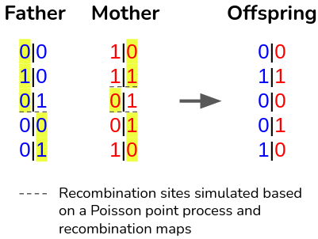

# <b style="color:red">B</b>cf<b style="color:red">B</b>reeder

    

## Quick Start
<b>B</b>cf<b>B</b>reeder simulate offspring genomes based on given parental genomes.  \
<b>INPUT</b> :
- a <b>pedigree</b> in PLINK's format
- a <b> phased bcf/vcf </b> containing the founders of the pedigree
- <b>recombination maps</b>

<b>OUTPUT</b> :
- a <b>phased bcf/vcf</b> containing the genomes of founders and offspring

To run BcfBreeder use the following command : \
`./bin/toy --vcf <PATH_TO_INPUT_VCF> --region <CHROMOSOME> --output <OUTPUT_VCF_PATH> --map <PATH_TO_RECOMBINATION_MAP> --ped <PATH_TO_PEDIGREE> --seed <SEED_TO_SET_RANDOMNESS>`

You can run an example with the following command: \
`./bin/toy --vcf example/founders_genomes.bcf --region 22 --output example/simulated_genomes.bcf --map maps/genetic_maps.b37/chr22.b37.gmap.gz --ped example/pedigree.ped --seed 13524`

## Acknowaledgment
Most of the source code is based on code written by @odelaneau and @srubinacci in <a href="https://github.com/odelaneau/GLIMPSE">GLIMPSE</a>.
